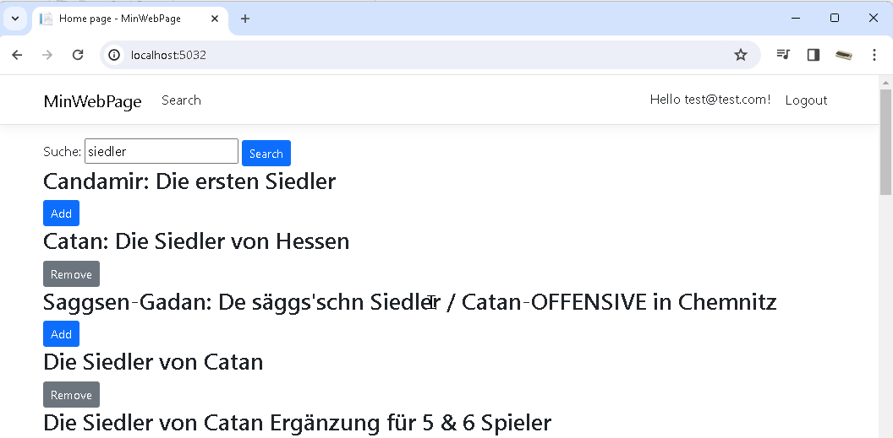

# "Min Asp.Net Demo" connect to BoardGame API
## Versionnumber 0.1.0 (2024-04-03)

Small Asp.Net Razor Demo/Proof-of-Concept with direct connection to the [Boardgame API](https://api.geekdo.com/xmlapi)  

  
_Screenshot main Window_  

## Features

* Register / Login _(Default Asp.Net Razor Template "Authentication type: Individual Accounts")_
* Game Search requests redirected to: _https://api.geekdo.com/xmlapi/search?search={0}_
* Serialize and deserialize Class generated with [xsd.exe tool](https://learn.microsoft.com/en-us/dotnet/standard/serialization/xml-schema-definition-tool-xsd-exe)
* Saving of the game selection to current User
* Depending on Status, "Add" or "Remove" Buttons are shown

## Roadmap / Future Features
* _no features planed_

## Known Bugs
* _none_

## Usage

* install nuget's _(if needed)_
* run DB migrations
* run update database
* start application

## SourceControl Link & Information
https://github.com/akumagamo/min-aspnet-boardgame-api.git

## Documentation

_...None..._